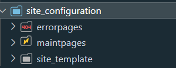
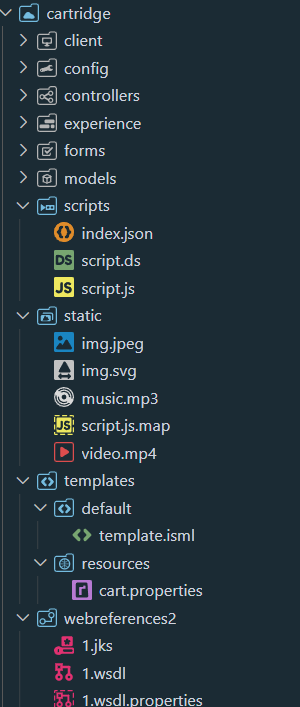
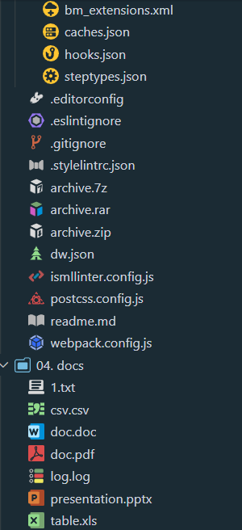
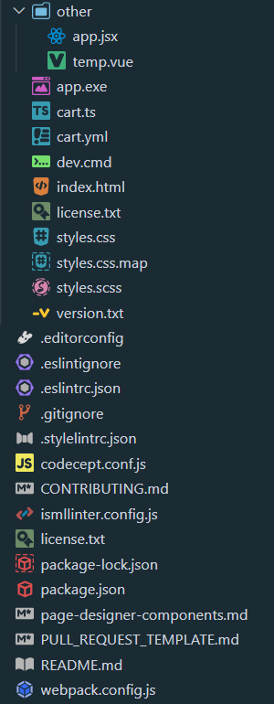

# 🦫 SFCC Beaver - Icons

> Icons pack created specially for **SFCC projects**

This extension provides **semantic** icons for the files and folders for SFCC project and most commonly used files.

## 🌲 Winter Update

Beaver had prepared his supplies and now it is winter time! It is colder now so your folders  have frozen too. But don't worry you also have a new year tree  on you dw.json file.

## 👁️‍🗨️ Icons

With different icons you can detect files and folders faster saving some time.

... and more.

## 💻 Usage

Once installed and after reloading VS Code, you will be presented with a message to Activate the icons.

In case this doesn't happen, navigate to:

- `Linux` & `Windows` => **File > Preferences > File Icon Theme > SFCC Beaver Icons.**
- `MacOS` => **Code > Preferences > File Icon Theme > SFCC Beaver Icons.**

or

- open command pallette and type **File Icon Theme**

## 👍 Recommendations

Install the parent extension **[🦫 SFCC Beaver](https://marketplace.visualstudio.com/items?itemName=SerhiiHlavatskyi.sfcc-beaver 'Open marketplace')** to extend VS Code functionality while working on SFCC projects.

## 📨 Feedback

Found a 🪲bug or want to improve something? Feel free to open an issue on GitHub: <https://github.com/foegit/sfcc-beaver-icons/issues>
