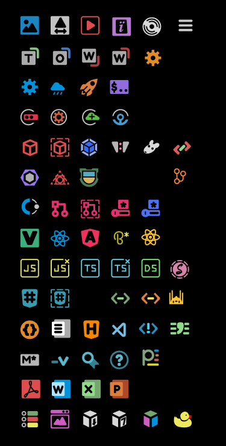
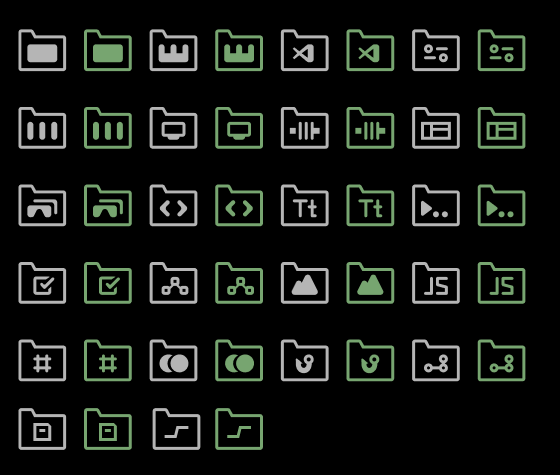
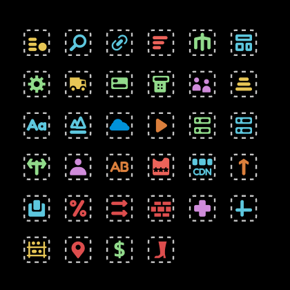

# 🦫 SFCC Beaver - Icons

> Icons pack created specially for **SFCC projects**

This extension provides **semantic** icons for the files and folders for SFCC project and most commonly used files.

##  Ukraine

Hi, I'm Serhii and I'm from Ukraine. Today every aspect of Ukrainians' lives suffers from russia's brutal unreasonable invasion and ongoing war. Despite that, we all do our best to hold up and share nice things with good people around. Including this extension.

There are many ways you can support Ukraine and therefore me. The most impactful is donations. Chose whatever you prefer and if you're not sure check <https://savelife.in.ua/en/>.

Let this be a good deed of a day! Thanks!

## 👁️‍🗨️ Icon List

With SFCC icons set navigation through SFCC projects becomes easier. Below you can find all available icons.

### Files

### Folders

### 🆕 Meta

## 💻 Usage

Once installed and after reloading VS Code, you will be presented with a message to Activate the icons.

In case this doesn't happen, navigate to:

- `Linux` & `Windows` => **File > Preferences > File Icon Theme > SFCC Beaver Icons.**
- `MacOS` => **Code > Preferences > File Icon Theme > SFCC Beaver Icons.**

or

- open command pallette and type **File Icon Theme**

## 👍 Recommendations

Install the parent extension **[🦫 SFCC Beaver](https://marketplace.visualstudio.com/items?itemName=SerhiiHlavatskyi.sfcc-beaver 'Open marketplace')** to extend VS Code functionality while working on SFCC projects.

## 📨 Feedback

Found a 🪲bug or want to improve something? Feel free to open an issue on GitHub: <https://github.com/foegit/sfcc-beaver-icons/issues>
